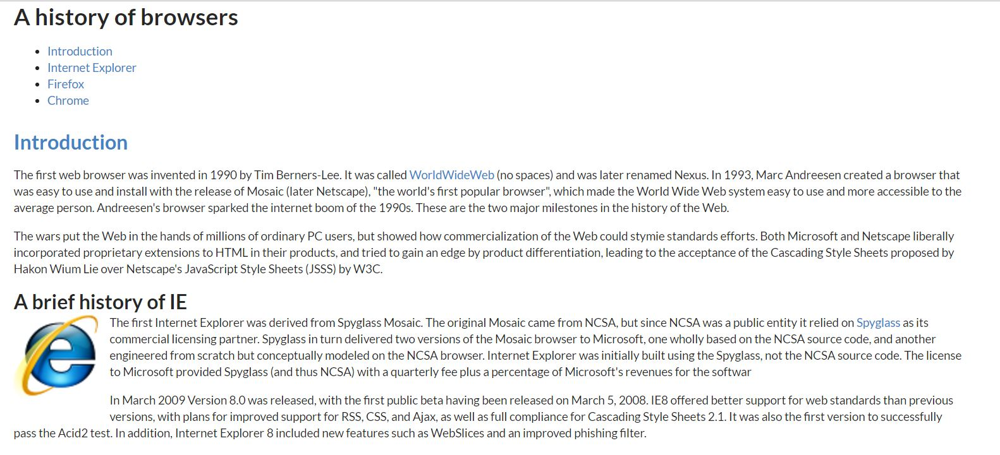

User interface is one of the most important things when developing Web applications. Frameworks make it possible to make web applications that will work on all types of screens, from desktops to smart phones or tablets. Using frameworks adjust the web application to the size of the screen. Frameworks allow you to design a layout without having to make specifications for different devices.
Semantic UI makes implementing the UI much less painless and much nicer to look at. 

WHAT ARE UI FRAMEWORKS? 
WHY DO WE USE THEM? 
WHY NOT USE RAW HTML & CSS?
-IT IS A PAIN
-SEMANTIC UI MAKES THINGS EASY AND PRETTY
## Semantic UI
Semantic UI has tons of libraries that do most of the formatting for you. It isn't too hard to start using, since the framework uses "human-friendly" HTML. 

For example, the image to the left is originally a square. To make this round, I just added the class "ui small circular image". With no additional CSS, the image is formatted to size small and appears circular.
But wait, there's more. There's a ton of other ways Semantic UI will make your life easier. Tip #1: encapsulating the body of your HTML file in a class "ui container" will give the content margins so your content isn't squished up against the edges. It starts to immediately look presentable. 

A fun way to exercise using frameworks is by picking a website and replicating it using Semantic UI. 
## UI Frameworks for an Engineer
SOFFTWARE ENGINEERING BENEFITS:;
- BE ABLE TO QUICKLY DEVELOP BEAUTIFUL WEB APPLICATIONS 
As an aspiring software engineer, I do not want to spend hours on the user interface, though I would like it to look nice. Doing this with raw HTML and CSS is not an easy task to accomplish. I've noticed quite an improvement in productivity when using Semantic UI.
