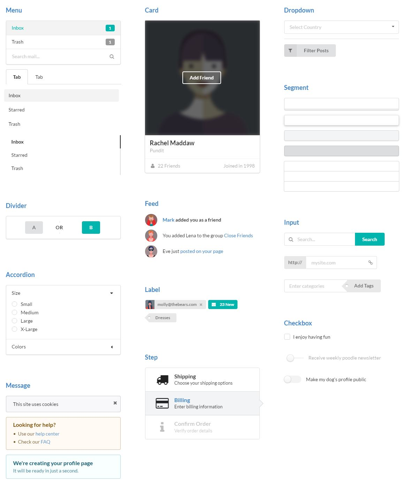

## User Interface

User interface is one of the most important things when developing Web applications. Today, the internet is accessed from all types of devices, not just the desktop computer. We have tablets and laptops and smartphones, but we need our websites to look nice and be formatted to fit the screen and still function on smaller devices. Frameworks make it possible to make web applications that will work on all types of screens. Frameworks allow you to design a layout without having to make specifications for different devices. Semantic UI is one of the frameworks available to use. With Semantic UI implementing the UI is much less painful and much nicer to look at. 

<input type="text" placeholder="Search..."><button type="button">Search
 

  <input type="text" placeholder="Search...">
  <button class="ui button">Search</button>

 
Here are two examples of a search bar. Can you tell which is made with Semantic UI and which is with raw HTML? Of course you can. The first looks quite outdated, doesn't it? We need to keep up with the rest of the web, and that doesn't mean adding multiple modifications to your stylesheet. It means using a framework like Semantic UI, which has all the styles defined for you. With Semantic UI, using about just as much HTML could bring your site into this century.

<!--WHAT ARE UI FRAMEWORKS? -->
<!--WHY DO WE USE THEM? -->
<!--WHY NOT USE RAW HTML & CSS?-->
<!---IT IS A PAIN-->
<!---SEMANTIC UI MAKES THINGS EASY AND PRETTY-->

## Semantic UI

<a href="http://semantic-ui.com/">Semantic UI</a> has tons of libraries that do most of the formatting for you. It isn't too hard to start using, since the framework uses "human-friendly" HTML. Below are examples of some elements or views that can be done using Semantic UI. Notice the style and how they looks as if they were developed in 2016 and not 1995. This framework also allows for customization, making it simple to put your own personal touch to it. 

A fun frameworks exercise is to use Semantic UI to replicate a website of your choosing. This was a challenging, yet rewarding exercise for me. I gained a lot of experience from creating things that all "real" websites have, like some menu or title bar at the top and a footer at the bottom of the page. Doing this exercise could also give you some neat design ideas for creating sites of your own. Take a look at my example of replicating <a href="https://www.arduino.cc/"> Arduino's</a> homepage.  

  

    

      

        Original
      

      
    

    
You don't have to recreate the entire site, just choose some portions to get started. I decided to recreate the menu bar, the footer, and a few of the body elements. The original photo is modified a little to include the footer at the bottom of the page in the screenshot. You may notice some minor differences in my version compared to the original but it's pretty close. You can take a look at my HTML and CSS for my recreation of Arduino's homepage <a href="https://github.com/kaseyhagi/arduino">here</a>.

    

      

        Replication using Semantic UI
      

      
    

  

## UI Frameworks for an Engineer

As an aspiring software engineer, I do not want to spend hours on creating an easy to look at, functional user interface. Doing this with raw HTML and CSS is not an easy task to accomplish. I've noticed that trying to design a simple website (before knowing about Semantic UI) involved spending many head scratching hours just to get a 1992 style website. There was quite an improvement in productivity when I started using Semantic UI. 
