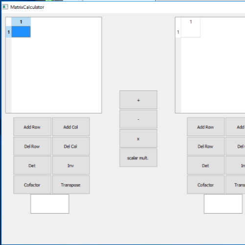

This was a group project for EE 205 Object-Oriented Programming. We created a matrix calculator with a GUI implemented in C++ with the Qt Creator IDE. The final application was an executable cross-platform application, which worked on both Windows and OSX. This project had an emphasis on C++ features such as operator and function overloading and layering. We used the Qt creator and included the Qt libraries to form our user interface. For this project, I wrote the class declarations an functions for all of the calculator's operations. I also assisted in the design of the GUI and debugging. 

The final product was able to perform functions on arbitrarily sized matrices. The matrix calculator implemented operations for two matrices such as addition, subtraction, and multiplication. The calculator also implemented operations for individual matrices such as computing the the inverse, transpose, and cofactor matrices, as well as the determinant. We imlemented two classes, the matrix class, which held the matrices that would be used in calculations, as well as the functions for each operation, and the matrix calculator class, which was the class that implemented the GUI. 

From this project, I learned about many C++ features such as operator overloading, function overloading, and layering. I was also given some experience on recursive functions, which I used specifically in calculating the determinant of a matrix.

