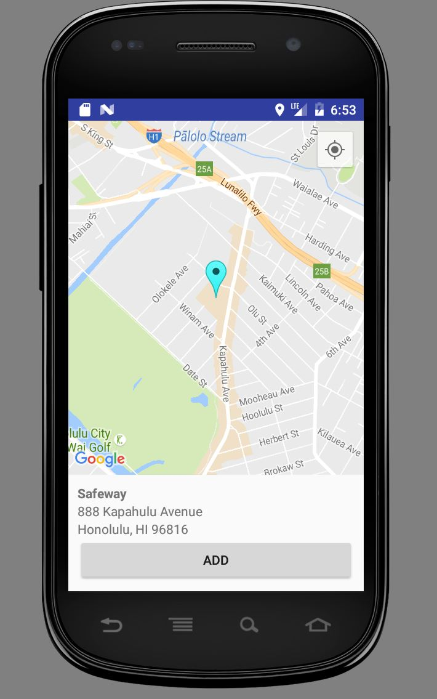
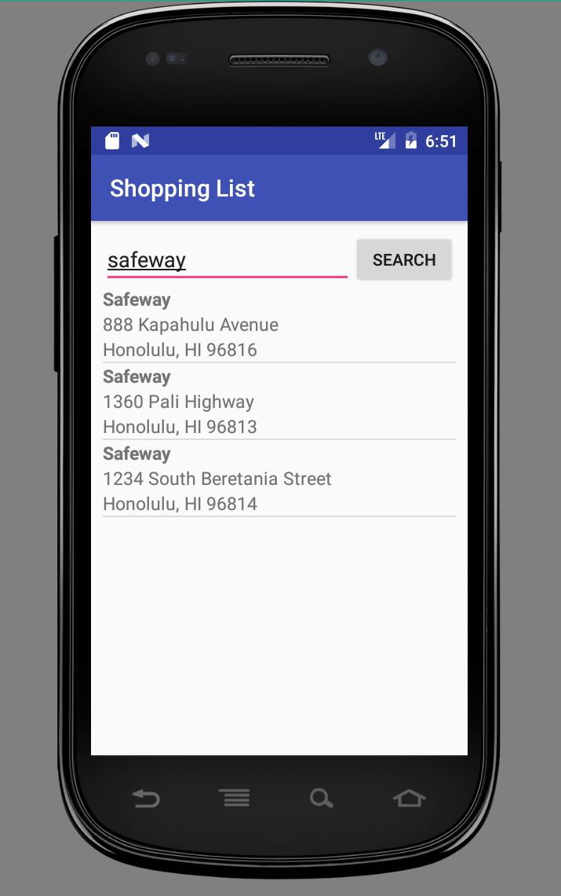

## What is it? 
This app is a shopping list app for Android. Users can make a shopping list on their Android devices. But wait, there's more. Users can specify their shopping list items to specific locations or stores with Google Maps. We decided on making this app because it is something we could personally use. Have you ever gone to the store to get a couple things, but you end up getting distracted and walk out with 10 things that were not on the list? If you answered yes to that question then this app is for you! 

## My Contributions
My main contribution to this project was utilizing the Google Maps API in our app. We really wanted users to be able to see their location and their stores on a map, and for the users to be able to search for stores by name in their area. I implemented the search functionality, which allows users to type in a store name and search results in their area would show with the address, and they would also be able to view them on a map. 

## Future Improvements
My project partner and I both agreed that after this semester was over and the project course was "done", we'd like to finish the app and make it something we could put up on the app store. One main feature I'd like to add is notifications. These notifications will pop up when the user is at a location where they have items on their list. The notifications would remind the user of the items they listed to buy at that location. This will eliminate the forgetfulness and the distraction while shopping! Another improvement we'd like to make is aesthetics. We want our app to be something more fun to look at, because user experience is very important in apps. 

Through this project, besides picking up another programming language (Java), I learned a lot about project management. This was a group project which required a lot of collaboration. One of the biggest challenges faced in this project was working on the same pieces of code together. We both had to get our hands dirty with Git to make this project cohesive. 
